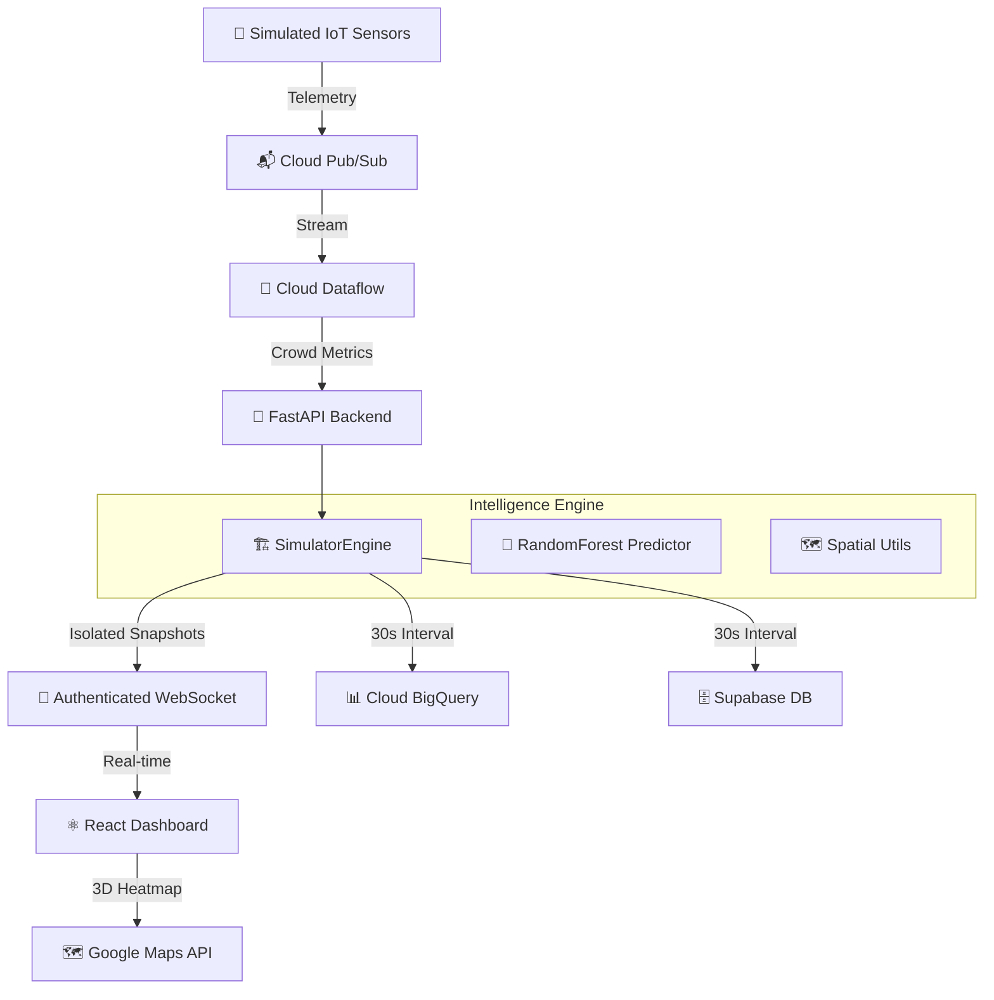

# SmartVenue AI: System Architecture

This document describes the high-level design, data flow, and maintainability strategy of the SmartVenue Intelligence Engine.

## 🏢 System Overview
SmartVenue is an autonomous Digital Twin engine designed for high-density venue management. It utilizes spatial clustering algorithms, gravity-flow physics, and Vertex AI (Gemini) to provide real-time crowd intelligence.

## 🌊 Data Lifecycle

## 🛡️ Sandbox Isolation (The Ethical Layer)
The engine provides absolute user isolation:
1. **Authenticated Sessions**: WebSockets require a JWT verified against Supabase JWKS.
2. **Procedural Identity**: Simulation parameters (theme, severity) are stored per `user_id`.
3. **Partitioned Ingest**: Every telemetry point in BigQuery and snapshots in Supabase are tagged with the unique user identity.

## 💎 Maintainability & Production Standards
- **Modular Spatial Logic**: All trigonometric and coordinate logic is isolated in `spatial_utils.py`.
- **Strict Typing**: Python PEP 484 and TypeScript Interfaces for all data structures.
- **Unified Logging**: Uses Google Cloud Structured Logging for correlation IDs and production observability.
- **Automated Validation**: Pytest suite covering Roster Integrity, API security, and Model prediction bounds.

## 🏗️ Adding New Venue Themes
To add a new theme (e.g., "Olympic Games"):
1. Add a new weight matrix to `app/utils/spatial_utils.py`.
2. Define the base congestion levels for all 25 calibrated zones.
3. The engine automatically handles gravity flow and wait-time predictions.
