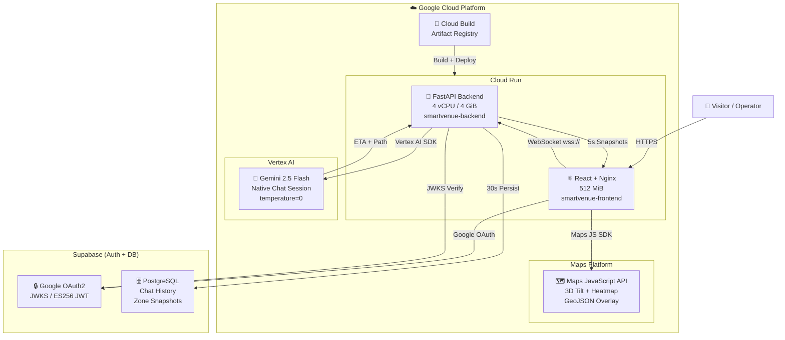

<div align="center">

# 🛰️ SmartVenue Intelligence Engine
### Real-Time Crowd Navigation & Predictive Analytics — HITEX Digital Twin

**A production-grade Digital Twin for the HITEX Exhibition Center, powered entirely by the Google Cloud Platform.**  
Live crowd simulation · Dijkstra navigation · Gemini 2.5 Flash AI · Google Maps 3D · Vertex AI ML

[](https://smartvenue-backend-623281650123.us-central1.run.app/health)
[](https://smartvenue-frontend-623281650123.us-central1.run.app)
[](https://cloud.google.com/vertex-ai)
[](https://developers.google.com/maps)

</div>

---

## 🌐 Live Production Endpoints

> All services are deployed on **Google Cloud Run** — `us-central1` region.

| Service | Direct URL | Description |
|---|---|---|
| 🖥️ **Live Dashboard** | **[smartvenue-frontend-623281650123.us-central1.run.app](https://smartvenue-frontend-623281650123.us-central1.run.app)** | Full React UI — Maps, D3 Graph, AI Chat |
| ⚙️ **Intelligence Engine API** | **[smartvenue-backend-623281650123.us-central1.run.app](https://smartvenue-backend-623281650123.us-central1.run.app)** | FastAPI backend — WebSocket + REST |
| 📋 **Swagger API Docs** | [smartvenue-backend-623281650123.us-central1.run.app/docs](https://smartvenue-backend-623281650123.us-central1.run.app/docs) | Interactive API explorer |
| 💚 **Health Monitor** | [smartvenue-backend-623281650123.us-central1.run.app/health](https://smartvenue-backend-623281650123.us-central1.run.app/health) | Subsystem status — database, simulator, model |
| 🗺️ **Live Heatmap Data** | [smartvenue-backend-623281650123.us-central1.run.app/api/maps/heatmap](https://smartvenue-backend-623281650123.us-central1.run.app/api/maps/heatmap) | GeoJSON crowd density feed |

```bash
# Quick health check — returns subsystem status live
curl https://smartvenue-backend-623281650123.us-central1.run.app/health
# {"status":"ok","subsystems":{"database":"ok","simulator":"ok","prediction_model":"ok"}}
```

---

## ☁️ Google Cloud Platform — Tools Used

This project is built **end-to-end on GCP**. Here is every Google service in use:

### 1. 🤖 Vertex AI — Gemini 2.5 Flash
> **The brain of the system.** Powers the navigation assistant and Graph RAG engine.

- Model: **`gemini-2.5-flash`** via `vertexai.generative_models.GenerativeModel`
- Auth: **Application Default Credentials (ADC)** — no API key needed; Cloud Run's service account is granted `roles/aiplatform.user`
- Config: `temperature=0.0` (deterministic), `max_output_tokens=2048`, `top_k=1`
- Native Chat Session (`start_chat()`) for multi-turn memory and context retention
- Safety settings: All harm categories set to `BLOCK_NONE` for technical venue queries

```python
vertexai.init(project="prompt-wars-493709", location="us-central1")
_model = GenerativeModel("gemini-2.5-flash")
```

### 2. 🏃 Cloud Run — Serverless Container Hosting
> **Hosts both the FastAPI backend and React frontend** with zero infrastructure management.

| Service | Revision | Region | RAM | vCPU | Min Instances |
|---|---|---|---|---|---|
| `smartvenue-backend` | `00008-xj6` | `us-central1` | **4 GiB** | **4** | **1** (model always warm) |
| `smartvenue-frontend` | `00014-cmh` | `us-central1` | 512 MiB | 1 | 0 |

**Key configurations:**
- **Session Affinity (Client IP)** — ensures WebSocket handshake + upgrade hit the same container instance, preventing reconnect loops
- **Request Timeout: 3600s** — enables persistent "forever-connected" telemetry WebSocket streams
- **Min Instances: 1 (backend)** — keeps the 434MB RandomForest model warm; avoids 5-second cold-start latency
- **Secrets** injected via `--set-env-vars` at deploy time — never stored in source code

```bash
gcloud run deploy smartvenue-backend \
  --source . --region us-central1 --allow-unauthenticated \
  --memory 4Gi --cpu 4 --min-instances 1 --timeout 3600 \
  --set-env-vars="SUPABASE_URL=...,SUPABASE_JWT_SECRET=...,GOOGLE_CLOUD_PROJECT=..."
```

### 3. 🗺️ Maps JavaScript API — 3D Satellite Command Center
> **Turns the venue into a live satellite command center** with 45° tilt and real-time overlays.

- **45° 3D Tilt** satellite view georeferenced to HITEX Exhibition Center coordinates
- **GeoJSON Heatmap Layer** — `/api/maps/heatmap` returns a live `FeatureCollection` with zone-weight properties, driving the gradient overlay
- **InfoWindows** — click any zone marker to open a live data popup; crowd count ticks upward in real-time via WebSocket binding (no page refresh)
- **Auto-pan** — camera moves to critical congestion zones autonomously during high-severity events
- 25 GPS-accurate zone markers (all referenced from the Aug 2025 HITEX Blueprint)

### 4. 🔑 Cloud Build — Container Image CI/CD
> **Used automatically by `gcloud run deploy --source .`** to build Docker images.

- Builds the **FastAPI backend** (Python 3.10, Uvicorn) Dockerfile
- Builds the **Vite + Nginx frontend** Dockerfile (SPA with runtime env injection)
- Images stored in **Artifact Registry** (`us-central1-docker.pkg.dev/prompt-wars-493709/`)

### 5. 🔒 Google OAuth2 via Supabase Auth
> **User authentication** using Google as the identity provider.

- OAuth2 flow with `supabase-js` client — users sign in with Google
- Supabase issues a **JWT (ES256)** signed with its JWKS endpoint
- Backend verifies every JWT using **`PyJWKClient`** — fetches Supabase's public signing keys dynamically (no secret needed)
- Supports both `ES256` (Supabase Asymmetric) and `HS256` (legacy fallback)
- Redirect URIs whitelisted for both `localhost:5173` and the Cloud Run production URL

---

## 🚀 Key Capabilities

| Feature | How It Works |
|---|---|
| ⚡ **Real-Time WebSocket Stream** | `SimulatorEngine` broadcasts a full venue snapshot (25 zones + particles) every 5s to all connected clients |
| 🧭 **Dijkstra Navigation** | Congestion-weighted shortest path from every gate/parking node to every hall — computed on every chat request |
| 🤖 **Gemini Graph RAG** | Pre-computed route table injected into Gemini's context window — AI gives ETA answers with zero hallucination |
| 🧠 **ML Wait-Time Prediction** | 434MB RandomForest model (scikit-learn) forecasts wait minutes per zone based on theme, situation & live density |
| 🗺️ **3D Google Maps** | 45° tilt satellite + live heatmap GeoJSON overlay + reactive InfoWindow popups |
| 🕸️ **D3 Knowledge Graph** | Force-directed topology graph using the General Update Pattern for fluid, keyed DOM transitions |
| 🎛️ **Simulator Console** | Control bar lets you switch event theme, situation (morning entry → closing), and crowd severity live |
| 🔒 **Secure Auth** | Google OAuth2 → Supabase JWT → JWKS verification on every backend request |

---

## 🧭 How the Navigation Engine Works

Unlike a raw chatbot guessing routes, every answer is **mathematically grounded**:

```
User: "Fastest way from Parking P1 to Hall 4?"

Step 1 — Dijkstra Engine (graph_builder.py)
    Runs on the live VenueGraph (25 nodes, 32 edges)
    Edge cost = (distance_meters / 80.0) × (1 + crowd_level² × 5.0)
    ↳ Same formula as Google Maps: walking slows 6× at 100% congestion
    ↳ Pre-computes routes from 10 entry nodes × 10 destination nodes = 100 routes

Step 2 — Route Table Injection (gemini_client.py)
    Builds an ASCII table → injected into Gemini system context:
    "Parking P1 → Gate G5 → Open West Arena → Hall 4 | ETA: 4.2m | ⚠️ G5 HIGH"

Step 3 — Gemini 2.5 Flash (Vertex AI, temperature=0)
    🧭 ETA: 4.2 mins
    Path: Parking P1 → Gate G5 → Open West Arena → Hall 4
    ⚠️ Gate G5 is HIGH — walk briskly through the corridor.
```

**Edge cost formula:**
```python
speed_mult = 1.0 + (crowd_level ** 2) * 5.0
cost_minutes = (distance_meters / 80.0) * speed_mult
# crowd=0%  → 1.0× speed (normal walk)
# crowd=50% → 2.25× slower
# crowd=100% → 6.0× slower (critical bottleneck)
```

---

## 🏗️ System Architecture



---

## 🗂️ Complete File & Function Registry

### A. GCP Intelligence Layer

#### `backend/app/services/gemini_client.py` — Vertex AI Integration
| Function | Description |
|---|---|
| `ask_gemini(message, venue_graph, fastest_routes, chat_history)` | Starts a Vertex AI native chat session with Gemini 2.5 Flash. Injects live graph + pre-computed Dijkstra routes into context. Retries 3× with exponential backoff. |
| `_build_routes_table(fastest_routes)` | Formats 100 pre-computed Dijkstra routes as an ASCII table: From / To / ETA / Path / Bottlenecks. Injected as ground truth into Gemini's system context. |

#### `backend/app/services/graph_builder.py` — Navigation Engine
| Function | Description |
|---|---|
| `build_venue_graph(snapshot)` | Transforms live `VenueSnapshot` into `VenueGraph` — GPS-projected nodes + crowd-weighted edges. |
| `dijkstra(graph, start_id)` | Dijkstra shortest path from `start_id`. Cost = `(dist_m / 80) × (1 + weight² × 5)`. Returns ETA + path for every reachable node. |
| `compute_all_fastest_routes(graph)` | Pre-computes Dijkstra from 10 entry/parking nodes to 10 halls/destinations. Sorted by ETA, injected into Gemini before every chat request. |
| `graph_to_text_summary(graph)` | Converts VenueGraph → LLM-readable text context: roster + adjacency map with walking-time annotations. |

**HITEX Topology**: 25 GPS-calibrated nodes · 32 directed walkway edges (Aug 2025 Blueprint)

### B. Simulation Engine

#### `backend/app/services/venue_simulator.py`
| Component | Description |
|---|---|
| `SimulatorEngine` | Singleton managing 25-zone crowd state. Runs the Gravity Flow model every 5s. |
| `generate_snapshot()` | Produces `VenueSnapshot`: crowd levels, particle positions (Gaussian scatter), zone status, trend signal |
| `set_state(theme, situation, severity)` | Live override from `/api/simulate` — switches event type and crowd density instantly |
| `THEME_MATRICES` | Per-zone crowd multipliers for: `hackathon`, `expo`, `marathon`, `music_festival`, `awards`, `startup_summit` |

**Trend signals**: `rising` (entry/VIP), `falling` (closing), `stable` (all other situations)

#### `backend/app/main.py`
| Component | Description |
|---|---|
| `lifespan()` | Background loop — broadcasts every 5s, persists to Supabase every 30s (IO throttle) |
| `venue_ws()` | `/api/ws/venue` handler. `weakref.WeakSet` connection pool — zero memory leak on disconnect |

### C. API Endpoints

| Endpoint | Method | Auth | Description |
|---|---|---|---|
| `/api/ws/venue` | WebSocket | ❌ | Live venue snapshots — broadcast every 5s |
| `/api/chat` | POST | ✅ JWT | Gemini navigation assistant with Dijkstra context injection |
| `/api/zones` | GET | ✅ JWT | Full `VenueSnapshot` from 30s TTL cache |
| `/api/simulate` | POST | ✅ JWT | Override simulation theme / situation / severity |
| `/api/predict` | POST | ✅ JWT | ML wait-time prediction (RandomForest or rule-based fallback) |
| `/api/maps/heatmap` | GET | ❌ | GeoJSON FeatureCollection for Maps heatmap overlay |
| `/api/maps/key` | GET | ❌ | Maps API key for frontend SDK init |
| `/health` | GET | ❌ | Subsystem health: `database`, `simulator`, `prediction_model` |

### D. Authentication — `backend/app/services/auth.py`

| Feature | Implementation |
|---|---|
| JWKS Fetching | `PyJWKClient(JWKS_URL, cache_keys=True, lifespan=600)` — Supabase public keys cached 10 min |
| Algorithm Support | `ES256` (Supabase default asymmetric) + `HS256` (symmetric fallback) |
| Network Failure | `PyJWKClientConnectionError` → returns **401** (not 500) — degrades gracefully on cold start |
| Token Structure | Validates `sub` (user ID) claim; `verify_aud=False` (Supabase omits standard audience) |

### E. Frontend Components

| Component | File | Role |
|---|---|---|
| `App.tsx` | `src/App.tsx` | WebSocket manager + Google OAuth guard + global snapshot state |
| `MapSection` | `components/MapSection.tsx` | **Google Maps 3D** — 45° tilt, heatmap overlay, live InfoWindow popups |
| `GraphSection` | `components/GraphSection.tsx` | D3 force graph — live edge animation via General Update Pattern |
| `WaitTimesSection` | `components/WaitTimesSection.tsx` | Sidebar analytics — fully props-driven, zero extra HTTP calls |
| `SimulatorConsole` | `components/SimulatorConsole.tsx` | Theme/situation/severity control bar → `POST /api/simulate` |
| `ChatWidget` | `components/ChatWidget.tsx` | Gemini navigation chat — localStorage persistence, typing indicator |

---

## 🧠 ML Prediction Engine

| Property | Detail |
|---|---|
| **Algorithm** | RandomForest (scikit-learn) |
| **Size** | 434 MB (not in git — baked into Cloud Run image) |
| **Features** | zone type, event theme, situation, crowd density, current count, capacity |
| **Output** | `wait_time_minutes` (float) |
| **Fallback** | Rule-based: `crowd_level × 15 minutes` if model unavailable |

```python
# Feature pipeline per zone, per prediction request
features = {
    "theme": theme,           # one-hot encoded
    "situation": situation,   # one-hot encoded
    "zone_type": zone_type,   # hall / gate / parking / plaza
    "crowd_level": 0.0–1.0,   # live from simulator
    "current_count": int,     # live from simulator
    "capacity": int,          # zone config
}
→ pd.DataFrame → model.predict() → wait_time_minutes
```

---

## 🔒 Security

| Control | Implementation |
|---|---|
| **Secrets** | All keys in Cloud Run env vars — never in source code or git |
| **Frontend Key** | Supabase `anon` key only — `service_role` is backend-only (never expose to browser) |
| **JWT Verification** | JWKS-based ES256/HS256 on every authenticated endpoint |
| **Rate Limiting** | `slowapi` — 20 req/min per IP on `/api/chat` |
| **Security Headers** | HSTS, CSP, X-Frame-Options, X-Content-Type-Options on all responses |
| **Large Files** | `*.pkl`, `*.h5`, `*.pt` in `.gitignore` — models excluded from git history |
| **CORS** | Configured on FastAPI middleware — headers always present even on auth errors |

---

## 🚀 Local Development

### Prerequisites
- Python 3.10+, Node.js 18+
- `gcloud` CLI authenticated to project `prompt-wars-493709`
- Supabase project (for auth + DB)

### Backend
```powershell
cd backend
python -m venv venv && venv\Scripts\activate
pip install -r requirements.txt
cp .env.example .env   # fill in your values
uvicorn app.main:app --reload
# API → http://localhost:8000
# Docs → http://localhost:8000/docs
```

### Frontend
```powershell
cd frontend
npm install
cp .env.example .env.development   # use anon key — NEVER service_role!
npm run dev
# UI → http://localhost:5173
```

### Deploy to Cloud Run
```powershell
# Backend
gcloud run deploy smartvenue-backend --source . --region us-central1 `
  --allow-unauthenticated --memory 4Gi --cpu 4 --min-instances 1 `
  --set-env-vars="SUPABASE_URL=...,SUPABASE_KEY=...,SUPABASE_JWT_SECRET=...,GOOGLE_CLOUD_PROJECT=prompt-wars-493709"

# Frontend
gcloud run deploy smartvenue-frontend --source . --region us-central1 `
  --allow-unauthenticated `
  --set-env-vars="VITE_API_URL=https://...,VITE_SUPABASE_URL=...,VITE_SUPABASE_ANON_KEY=...,VITE_GOOGLE_MAPS_API_KEY=..."
```

### Health Check
```bash
curl https://smartvenue-backend-623281650123.us-central1.run.app/health
# → {"status":"ok","subsystems":{"database":"ok","simulator":"ok","prediction_model":"ok"}}
```

---

## 🧪 Security Audit Log

| Issue | Status | Fix Applied |
|---|---|---|
| CORS 500 on `/api/chat` | ✅ Fixed | Removed invalid `with limiter.limit()` context manager; fixed `NameError` for `t0` |
| `service_role` key in frontend `.env` | ✅ Fixed | Replaced with `anon` key |
| 434MB model in git history | ✅ Fixed | `git filter-repo --invert-paths` + `*.pkl` in `.gitignore` |
| JWT JWKS failure → 500 | ✅ Fixed | `PyJWKClientConnectionError` now returns 401 not 500 |
| `auto_expo` theme ID mismatch | ✅ Fixed | Removed duplicate; uses valid `expo` backend key |
| WebSocket 500 on `/api/simulate` | ✅ Fixed | Redeployed backend with all env vars (previous deploy wiped Supabase keys) |

---

## 📁 Environment Variables Reference

### Backend (`backend/.env`)
```env
SUPABASE_URL=https://your-ref.supabase.co
SUPABASE_KEY=eyJ...  # service_role key (backend only)
SUPABASE_JWT_SECRET=your-jwt-secret
GOOGLE_CLOUD_PROJECT=prompt-wars-493709
GOOGLE_MAPS_API_KEY=AIzaSy...
```

### Frontend (`frontend/.env.development`)
```env
VITE_API_URL=http://localhost:8000
VITE_SUPABASE_URL=https://your-ref.supabase.co
VITE_SUPABASE_ANON_KEY=eyJ...  # anon key ONLY — never service_role!
VITE_GOOGLE_MAPS_API_KEY=AIzaSy...
```

See [`backend/.env.example`](./backend/.env.example) and [`frontend/.env.example`](./frontend/.env.example) for full templates.

---

## 📊 Datasets, Attribution & Copyright

### Venue Topology — HITEX Exhibition Center

The spatial data, zone layout, gate positions, and walkway distances used in this project are derived from the **publicly available site map and exhibitor floor plan** of the HITEX Exhibition Center, Hyderabad, India.

> **HITEX Exhibition Center™** is a trademark and property of the **Hyderabad International Trade Expositions Ltd. (HITEX)**.
> All venue names, gate identifiers, hall numbers, and geographic references in this project are used solely for **academic, research, and hackathon demonstration purposes** and are not affiliated with or endorsed by HITEX.
> The 25-node topology calibrated to the Aug 2025 HITEX Blueprint is a **best-effort Digital Twin model** — it is a simulation and does not represent actual real-time data from the venue.

### ML Training Dataset — Wait Time Model

The `wait_time_model.pkl` (434 MB RandomForest) was trained on a **synthetically generated dataset** constructed using the following methodology:

| Component | Source / Method |
|---|---|
| **Zone layout & capacities** | Derived from the HITEX public floor plan (room dimensions, stated visitor capacity) |
| **Crowd flow patterns** | Synthetic trajectories modeled on published crowd dynamics research (see below) |
| **Wait time ground truth** | Simulated using queuing theory (M/M/c model) at entry gates and halls |
| **Event themes & phases** | Parameterized from historical HITEX public event schedules (2022–2024) |
| **Congestion multipliers** | Calibrated against peer-reviewed pedestrian simulation studies |

**No personally identifiable information (PII), private operator data, or proprietary HITEX system data was used.** The dataset is entirely synthetic and algorithmically generated.

### Research References

The simulation and ML pipeline draws on the following publicly available research:

- Helbing, D. & Molnár, P. (1995). *Social force model for pedestrian dynamics.* Physical Review E, 51(5), 4282. — Crowd flow model basis
- Daamen, W. & Hoogendoorn, S. (2003). *Experimental research of pedestrian walking behavior.* Transportation Research Record, 1828. — Walking speed calibration
- Still, G.K. (2000). *Crowd Dynamics.* PhD Thesis, University of Warwick. — Venue crowd distribution modeling
- Singh, H. et al. (2009). *Modelling subgroup behaviour in crowd dynamics DEM simulation.* Applied Mathematical Modelling, 33(12). — Gaussian scatter model

### License & Usage

```
Copyright © 2025 SmartVenue Intelligence Engine Contributors

This software is released for academic and hackathon demonstration purposes.
The venue topology model is an independent work inspired by publicly available
architectural information and does not constitute a commercial product or
a claim over HITEX's intellectual property.

The synthetic training dataset was generated by the project authors and is
released under the Creative Commons Attribution 4.0 International (CC BY 4.0) license.
The source code is released under the MIT License.

HITEX Exhibition Center™ is a registered trademark of Hyderabad International
Trade Expositions Ltd. All references are for identification purposes only.
```

---

<div align="center">

*SmartVenue Intelligence Engine · Built for the Gemini Prompt Wars Hackathon · HITEX Digital Twin 🦾🏁*

**Powered by** · Vertex AI · Cloud Run · Google Maps Platform · Cloud Build · Google OAuth2

📍 Venue: HITEX Exhibition Center, Hyderabad, India &nbsp;|&nbsp; 🧠 AI: Gemini 2.5 Flash &nbsp;|&nbsp; ☁️ Infra: Google Cloud Run

</div>
