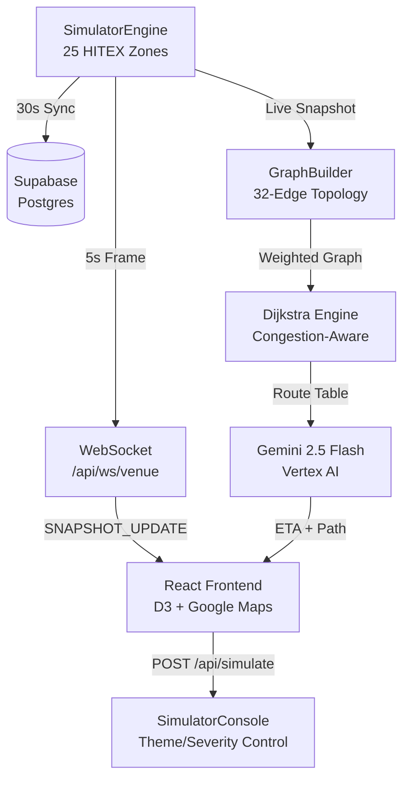

# 🛰️ SmartVenue Intelligence Engine
**Real-Time Crowd Navigation & Predictive Analytics — HITEX Digital Twin**

SmartVenue is a production-grade **Digital Twin** system for the HITEX Exhibition Center. It delivers real-time crowd intelligence, Google Maps-style route navigation, and live IoT simulation — all running live on Google Cloud Run.

---

## 🌐 Live Production URLs

| Service | URL |
|---|---|
| **Dashboard (UI)** | [smartvenue-frontend-623281650123.us-central1.run.app](https://smartvenue-frontend-623281650123.us-central1.run.app) |
| **Intelligence Engine (API)** | [smartvenue-backend-623281650123.us-central1.run.app](https://smartvenue-backend-623281650123.us-central1.run.app) |
| **API Docs (Swagger)** | `/docs` on the backend URL |

---

## 🚀 Key Capabilities

| Feature | Details |
|---|---|
| ⚡ **Real-Time WebSocket Stream** | Sub-second venue frames broadcast to all clients every 5s via `/api/ws/venue` |
| 🧭 **Dijkstra Navigation Engine** | Google Maps-style pathfinding using live congestion — fastest route from any gate to any hall |
| 🤖 **Gemini 2.5 Flash AI** | Graph RAG assistant with pre-computed route table injection; answers navigation questions with exact ETAs |
| 🧠 **ML Wait-Time Prediction** | Scikit-learn RandomForest model predicting wait times across 25 HITEX zones |
| 🗺️ **3D Google Maps Integration** | 45° tilt satellite map with live heatmap overlays, clickable zone popups, and auto-pan to bottlenecks |
| 🕸️ **D3 Knowledge Graph** | Animated venue topology showing live congestion flow across 32 walkway edges |
| 🔒 **Supabase Google OAuth** | Secure sign-in with multi-environment redirect (localhost + production) |
| 🏗️ **Production-Hardened** | GCP Cloud Run — 4 vCPU / 4GiB RAM, Session Affinity, GZIP, HSTS, CSP headers |

---

## 🛠️ Technology Stack

| Layer | Technology | Role |
|---|---|---|
| **Frontend** | React 18 + Vite 5 + TypeScript | Reactive real-time UI |
| **Backend** | FastAPI + Uvicorn + Python 3.10 | Async WebSocket & REST API |
| **Navigation** | Dijkstra Algorithm (custom) | Congestion-weighted shortest path |
| **AI Intelligence** | Vertex AI — Gemini 2.5 Flash | Graph RAG + Navigation assistant |
| **ML Prediction** | Scikit-learn (RandomForest) | Wait-time forecasting |
| **Data Processing** | Pandas + NumPy | Real-time feature engineering |
| **Visualization** | D3.js + Google Maps JS SDK | Graph & spatial rendering |
| **Auth** | Supabase + Google OAuth2 | JWT-based session management |
| **Infrastructure** | Google Cloud Run | Serverless, auto-scaling containers |
| **Database** | Supabase (PostgreSQL) | Chat history & zone snapshots |

---

## 🧭 How the Navigation Works

Unlike a raw chatbot, the AI is grounded in pre-computed physics:

```
User: "Fastest way from Parking P1 to Hall 4?"

1. [Dijkstra Engine]  → Computes all routes from Parking P1 using live congestion weights
                          Cost = (distance_m / 80.0) × (1 + crowd_level² × 5)
                          → Same model as Google Maps travel time estimation

2. [Route Table]      → Injects pre-computed ETAs into Gemini context:
                          "Parking P1 → Gate G5 → Arena → Hall 4 | ETA: 4.2m | ⚠️ G5 HIGH"

3. [Gemini 2.5 Flash] → Returns formatted navigation (temperature=0.0, deterministic):
                          🧭 ETA: 4.2 mins
                          Path: Parking P1 → Gate G5 → Open West Arena → Hall 4
                          ⚠️ Gate G5 is HIGH — walk briskly.
```

---

## 🏗️ Architecture



---

## 🔒 Security

- **No secrets in code**: All keys injected via Cloud Run env vars or local `.env` (gitignored)
- **Anon key only on frontend**: Service Role key is backend-only
- **JWT Auth**: Every authenticated endpoint verifies Supabase ES256/HS256 tokens via JWKS
- **Rate limiting**: `slowapi` — 20 req/min per IP on chat endpoint
- **Security Headers**: HSTS, CSP, X-Content-Type-Options, X-Frame-Options on all responses
- **DDoS mitigation**: GZip compression + Cloud Run auto-scaling

---

## 🚀 Local Development

### Prerequisites
- Python 3.10+, Node.js 18+
- GCloud SDK authenticated to your project
- Supabase project

### 1. Backend
```powershell
cd backend
python -m venv venv
venv\Scripts\activate
pip install -r requirements.txt

# Copy and fill in your secrets
cp .env.example .env

uvicorn app.main:app --reload
# → http://localhost:8000
# → Swagger docs: http://localhost:8000/docs
```

### 2. Frontend
```powershell
cd frontend
npm install

# Copy and fill in your secrets (use ANON key, not service_role!)
cp .env.example .env.development

npm run dev
# → http://localhost:5173
```

### 3. ML Model
The `wait_time_model.pkl` (434MB) is **not stored in git**. Download it from:
```
gs://prompt-wars-493709-models/wait_time_model.pkl
```
Or train it locally:
```powershell
cd backend
python scripts/summarize_trajectories.py
```

---

## 🧪 Health Check
```bash
curl https://smartvenue-backend-623281650123.us-central1.run.app/health
# → {"status":"ok","subsystems":{"database":"ok","simulator":"ok","prediction_model":"ok"}}
```

---

## 📄 Documentation
- **[SMART_VENUE_SYSTEM.md](./SMART_VENUE_SYSTEM.md)** — Deep technical architecture & function registry
- **[backend/.env.example](./backend/.env.example)** — Backend environment variable reference
- **[frontend/.env.example](./frontend/.env.example)** — Frontend environment variable reference

---

*Built for the Gemini Prompt Wars Hackathon — HITEX Digital Twin 🦾🏁*
