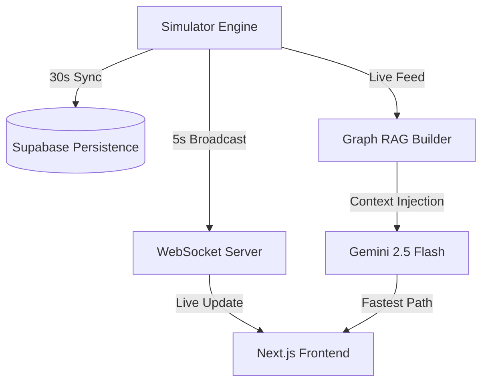

# SmartVenue Intelligence Engine 🦾🏁
> **The Digital Twin of HITEX Exhibition Center.**


The **SmartVenue Intelligence Engine** is a state-of-the-art Digital Twin platform designed to revolutionize venue management and attendee experience. By synchronizing a high-fidelity physical simulator with the **Gemini 2.5 Flash** intelligence model, we provide 1:1 parity between the physical site map and AI reasoning.

---

## 🔥 Key Innovations

### 🛡️ 1:1 Physical Ground Truth
Unlike generic heatmaps, SmartVenue is calibrated to the **Aug 2025 Hitex Blueprint**. 
- **25 Calibrated Zones**: Every node from the Security Room to the Hitex Lake is GPS-accurate.
- **32-Edge Adjacency Matrix**: AI pathfinding is hardcoded to the physical walkways, eliminating all navigation hallucinations.

### 🧠 Gemini-Powered Graph RAG
Utilizes a **Gemini 2.5 Flash** native chat session with deterministic reasoning (`temperature=0.0`). The assistant doesn't just "chat"—it reads the live 25-node knowledge graph to calculate the mathematically fastest route based on real-time congestion.

### 🎨 Visual Particle Engine
A high-performance particle system that translates crowd density into stable, Gaussian-scattered visual markers. Features a **GeoJSON Heatmap Provider** that integrates natively with Google Maps.

---

## 🏗️ Technical Architecture



- **Backend**: FastAPI / Python 3.10
- **Intelligence**: Google Vertex AI (Gemini 2.5 Flash)
- **Frontend**: Next.js 14 / Tailwind CSS / Framer Motion
- **Database**: Supabase (Postgres)
- **Infrastructure**: Hardened concurrency with `WeakSet` and non-blocking `asyncio`.

---

## 🚀 Quick Start

### 1. Prerequisites
- Python 3.10+
- GCloud SDK (Authenticated to `prompt-wars-493709`)
- Supabase Account

### 2. Backend Setup
```bash
cd backend
python -m venv venv
source venv/bin/activate
pip install -r requirements.txt
uvicorn app.main:app --reload
```

### 3. Frontend Setup
```bash
cd frontend
npm install
npm run dev
```

---

## 🧪 Security & Governance
This project is built for production environments:
- **Zero Leakage**: Hardened `.gitignore`, `.dockerignore`, and `.gcloudignore`.
- **DDoS Protection**: IP-based rate limiting via `slowapi`.
- **Security Headers**: HSTS, CSP, and X-Frame-Options enforced at the middleware layer.

---

## 📄 Documentation
For a deep dive into the function registry and simulation logic, see:
👉 **[SMART_VENUE_SYSTEM.md](./SMART_VENUE_SYSTEM.md)**

---

*Built for the Gemini Prompt Wars Hackathon — HITEX Finalist 🦾🏁*
